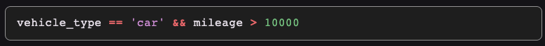

# Native Syntax Controller

A high-performance syntax highlighting controller using Flutter's native text rendering (TextSpan). No overlays, no sync issues, just a pure TextEditingController extension.




## Features

- **Formula Evaluation**: Evaluate mathematical and logical expressions using the expressions package
- **Enhanced Map Support**: Access Map properties using both `.property` and `['property']` syntax
- **Custom Functions**: Support for SUM, AVERAGE, IF, ARRAY_ANY, ARRAY_ALL, and more
- **Syntax Highlighting**: Automatic highlighting of functions, operators, numbers, and strings
- **Customizable Colors**: Change highlighting colors to match your app's theme

## Installation

Add this to your package's `pubspec.yaml` file:

```yaml
dependencies:
  native_syntax_controller: ^1.0.0
```

## Usage

### Basic Formula Evaluation

```dart
import 'package:native_syntax_controller/native_syntax_controller.dart';

void main() {
  // Simple arithmetic
  final result1 = evaluateFormula({}, '3 + 4 * 2');
  print(result1); // 11

  // With variables
  final result2 = evaluateFormula({'price': 100, 'tax': 0.15}, 'price * (1 + tax)');
  print(result2); // 115.0

  // With Map access
  final data = {'user': {'age': 25, 'score': 85}};
  final result3 = evaluateFormula(data, 'user.age > 18 && user.score >= 80');
  print(result3); // true
### Custom Functions

You can define your own functions for use in formulas:

```dart
import 'package:native_syntax_controller/native_syntax_controller.dart';

void main() {
  // Define custom functions
  final customFunctions = {
    'DOUBLE': (dynamic x) => _toNum(x) * 2,
    'SQUARE': (dynamic x) => _toNum(x) * _toNum(x),
    'GREET': (dynamic name) => 'Hello, $name!',
  };

  // Use custom functions in formulas
  final result1 = evaluateFormula({}, 'DOUBLE(5)', customFunctions: customFunctions);
  print(result1); // 10

  final result2 = evaluateFormula({'base': 3}, 'SQUARE(base) + DOUBLE(base)', customFunctions: customFunctions);
  print(result2); // 15 (9 + 6)

  final result3 = evaluateFormula({'name': 'World'}, 'GREET(name)', customFunctions: customFunctions);
  print(result3); // Hello, World!
### Direct Function Calls

You can also use the built-in functions directly in your Dart code:

```dart
import 'package:native_syntax_controller/native_syntax_controller.dart';

void main() {
  // Conditional logic
  final result1 = if_(true, 'Yes', 'No'); // 'Yes'

  // Mathematical functions
  final result2 = sin_(pi_ / 2); // 1.0
  final result3 = cos_(0); // 1.0

  // Array operations
  final data = [{'status': 'pass'}, {'status': 'fail'}];
  final result4 = arrayAny(data, 'status', 'fail'); // true
  final result5 = arrayAll(data, 'status', 'pass'); // false

  // Aggregation functions
  final result6 = sum(1, 2, 3, 4, 5); // 15
  final result7 = average(10, 20, 30); // 20
}
```

### Syntax Highlighting

```dart
import 'package:flutter/material.dart';
import 'package:native_syntax_controller/native_syntax_controller.dart';

class FormulaEditor extends StatefulWidget {
  @override
  _FormulaEditorState createState() => _FormulaEditorState();
}

class _FormulaEditorState extends State<FormulaEditor> {
  // Default highlighting
  final controller = SyntaxHighlightingController();

  @override
  Widget build(BuildContext context) {
    return TextField(
      controller: controller,
      decoration: InputDecoration(hintText: 'Enter formula...'),
    );
  }
}
```

### Custom Highlighting Colors

```dart
import 'package:flutter/material.dart';
import 'package:native_syntax_controller/native_syntax_controller.dart';

class CustomFormulaEditor extends StatefulWidget {
  @override
  _CustomFormulaEditorState createState() => _CustomFormulaEditorState();
}

class _CustomFormulaEditorState extends State<CustomFormulaEditor> {
  // Custom colors to match your app theme
  final controller = SyntaxHighlightingController(
    customStyles: {
      'function': TextStyle(color: Colors.blue, fontWeight: FontWeight.bold),
      'operator': TextStyle(color: Colors.red, fontWeight: FontWeight.bold),
      'number': TextStyle(color: Colors.green),
      'string': TextStyle(color: Colors.purple),
    },
  );

  @override
  Widget build(BuildContext context) {
    return TextField(
      controller: controller,
      decoration: InputDecoration(hintText: 'Enter formula...'),
    );
  }
}
```

## Supported Syntax Elements

The syntax highlighter recognizes and colors the following elements:

- **Functions**: `SUM`, `AVERAGE`, `IF`, `ARRAY_ANY`, `ARRAY_ALL`, etc.
- **Operators**: `+`, `-`, `*`, `/`, `=`, `>`, `<`, `!`, `&`, `|`, etc.
- **Numbers**: `42`, `3.14`, `1.5e10`
- **Strings**: `'hello'`, `"world"`

## Formula Examples

```dart
// Basic math
evaluateFormula({}, '2 + 3 * 4'); // 14

// Conditional logic
evaluateFormula({'score': 85}, 'IF(score > 80, "Pass", "Fail")'); // "Pass"

// Array operations
evaluateFormula({
  'items': [{'price': 10}, {'price': 20}, {'price': 30}]
}, 'SUM(items, "price")'); // 60

// Complex conditions
evaluateFormula({
  'user': {'role': 'admin', 'active': true},
  'permissions': ['read', 'write']
}, 'user.role == "admin" && user.active && ARRAY_ANY(permissions, null, "write")'); // true
```

## Error Handling

The package provides detailed error information when formula evaluation fails. All errors are thrown as `FormulaEvaluationException` with position information to help users identify and fix issues.

### Basic Error Handling

```dart
import 'package:native_syntax_controller/native_syntax_controller.dart';

void main() {
  try {
    final result = evaluateFormula({}, '3 + ');
    print(result);
  } catch (e) {
    print('Error: $e');
    // Output: Parse Error:
    // - Unexpected end of input at position 4
  }
}
```

### Handling Different Error Types

```dart
void evaluateWithErrorHandling(Map<String, dynamic> context, String formula) {
  try {
    final result = evaluateFormula(context, formula);
    print('Result: $result');
  } on FormulaEvaluationException catch (e) {
    print('Formula Error:');
    print(e.toString());
    
    // Access specific error details
    if (e.position != null) {
      print('Error at position: ${e.position}');
      print('Formula: ${e.originalFormula}');
      print('Error location: ${e.originalFormula.substring(0, e.position!)}^');
    }
  } catch (e) {
    print('Unexpected error: $e');
  }
}

// Examples of different errors:
evaluateWithErrorHandling({}, '3 + ');           // Parse error: incomplete expression
evaluateWithErrorHandling({}, 'undefined_var'); // Evaluation error: undefined variable
evaluateWithErrorHandling({}, 'UNKNOWN_FUNC()'); // Evaluation error: undefined function
evaluateWithErrorHandling({}, '15ss + 5');      // Multiple errors: invalid number format
evaluateWithErrorHandling({'mileage': 60000}, 'milesage > 100000'); // Evaluation error: undefined variable with typo
evaluateWithErrorHandling({'mileage': 60000, 'defects': []}, 'defecsts + milesage'); // Multiple evaluation errors: undefined variables
```

### Complex Formula with Multiple Errors

Here's an example of a complex formula with multiple typos and errors, showing how the package reports all issues at once:

```dart
// Complex formula with multiple errors
final complexFormula = '''
IF(user_role == 'inspector' && inspection_date != null, 
   IsF(ARRAY_ANY(defects, 'status', 'Fail'), 
       IF(ARRAYs_ANY(defects, 'severity', 'Critical'), 
          'Reject Vehicle', 
          IF(vehiclse_age > 15, 'Conditional Approval', 'Approve with Repairs')), 
       IF(mileasge > 100a000, 'Schedule Maintenance', 'Full Approval')), 
   'Access Denied')
''';

final context = {
  "user_role": "inspector",
  "inspection_date": "2025-12-11", 
  "vehicle_age": 8,
  "mileage": 60000,
  "defects": [{"status": "Pass", "severity": "Low"}]
};

try {
  final result = evaluateFormula(context, complexFormula);
  print('Result: $result');
} catch (e) {
  print('Error: $e');
}

// Output:
// Error: Multiple Errors:
// - Invalid number format: "100a000" - numbers cannot contain letters at position 250
// - Invalid formula syntax
// - Undefined function or variable 'IsF' at position 56
// - Undefined function or variable 'ARRAYs_ANY' at position 101
// - Undefined function or variable 'vehiclse_age' at position 167
// - Undefined function or variable 'mileasge' at position 239
```

### Single Undefined Variable Example

For cases with a single undefined variable (like a typo), the error message clearly identifies the problematic variable:

```dart
final context = {
  'user_role': 'inspector',
  'inspection_date': '2025-12-11',
  'vehicle_age': 8,
  'mileage': 60000,  // Note: 'mileage' not 'milesage'
  'defects': [{'status': 'Pass', 'severity': 'Low'}]
};

final formula = "IF(user_role == 'inspector' && inspection_date != null, IF(ARRAY_ANY(defects, 'status', 'Fail'), IF(ARRAY_ANY(defects, 'severity', 'Critical'), 'Reject Vehicle', IF(vehicle_age > 15, 'Conditional Approval', 'Approve with Repairs')), IF(milesage > 100000, 'Schedule Maintenance', 'Full Approval')), 'Access Denied')";

try {
  final result = evaluateFormula(context, formula);
  print('Result: $result');
} catch (e) {
  print('Error: $e');
}

// Output:
// Error: Evaluation Error:
// - Undefined function or variable 'milesage' at position 236
```

This clearly shows that 'milesage' is undefined, helping you spot the typo compared to the correct 'mileage' in the context.

### Multiple Undefined Variables Example

When a formula contains multiple undefined variables, all of them are reported:

```dart
final context = {
  'user_role': 'inspector',
  'inspection_date': '2025-12-11',
  'vehicle_age': 8,
  'mileage': 60000,
  'defects': [{'status': 'Pass', 'severity': 'Low'}]
};

final formula = "IF(user_role == 'inspector' && inspection_date != null, IF(ARRAY_AcvNY(defecsts, 'status', 'Fail'), IF(ARRfAY_ANY(defects, 'severity', 'Critical'), 'Reject Vehicle', IF(vehicle_age > 15, 'Conditional Approval', 'Approve with Repairs')), IF(milesage > 1000s00, 'Schedule Maintenance', 'Full Approval')), 'Access Denied')";

try {
  final result = evaluateFormula(context, formula);
  print('Result: $result');
} catch (e) {
  print('Error: $e');
}

// Output:
// Error: Multiple Errors:
// - Invalid number format: "1000s00" - numbers cannot contain letters at position 251
// - Undefined function or variable 'ARRAY_AcvNY' at position 59
// - Undefined function or variable 'defecsts' at position 71
// - Undefined function or variable 'ARRfAY_ANY' at position 103
// - Undefined function or variable 'milesage' at position 240
```

This shows that even when there are multiple types of errors (invalid numbers, undefined functions, and undefined variables), each is identified specifically without generic "Invalid formula syntax" messages.

### Common Error Scenarios

```dart
// Parse errors (syntax issues)
evaluateFormula({}, '3 + (4 * 2');        // Missing closing parenthesis
evaluateFormula({}, 'IF(score > 80');     // Missing closing parenthesis and parameters

// Evaluation errors (runtime issues)
evaluateFormula({}, 'undefined_variable + 1');  // Variable not found
evaluateFormula({}, 'UNKNOWN_FUNCTION(5)');     // Function not found

// Type errors
evaluateFormula({}, 'SUM("not", "an", "array")'); // Expected array, got string

// Division by zero (returns infinity, not an error)
final result = evaluateFormula({}, '5 / 0');     // Returns: double.infinity
```

### Built-in Functions

The package provides several built-in functions that can be used both in formulas and directly in Dart code:

- `if_(condition, trueVal, falseVal)`: Conditional function
- `sin_(x)`, `cos_(x)`: Trigonometric functions
- `pi_`: Pi constant
- `average(a, [b, c, d])`: Calculate average of values
- `sum(a, [b, c, d, e])`: Calculate sum of values
- `arrayAny(array, field, value)`: Check if any array item matches
- `arrayAll(array, field, value)`: Check if all array items match

### SyntaxHighlightingController

Evaluates a formula expression with the given context variables and optional custom functions.

- `context`: Map of variables available in the formula
- `formula`: String expression to evaluate
- `customFunctions`: Optional map of custom functions to make available in the formula
- Returns: The result of the evaluation

### SyntaxHighlightingController

A TextEditingController that provides syntax highlighting for formula text.

#### Constructor

```dart
SyntaxHighlightingController({
  String? text,
  Map<String, TextStyle>? customStyles,
})
```

- `text`: Initial text for the controller
- `customStyles`: Optional custom styles for syntax highlighting

#### Custom Styles Map

The `customStyles` parameter accepts a map with these keys:

- `'function'`: Style for function names (SUM, IF, etc.)
- `'operator'`: Style for operators (+, -, *, etc.)
- `'number'`: Style for numeric literals
- `'string'`: Style for string literals

## Contributing

Contributions are welcome! Please feel free to submit a Pull Request.

## License

This project is licensed, see the LICENSE file for details.
